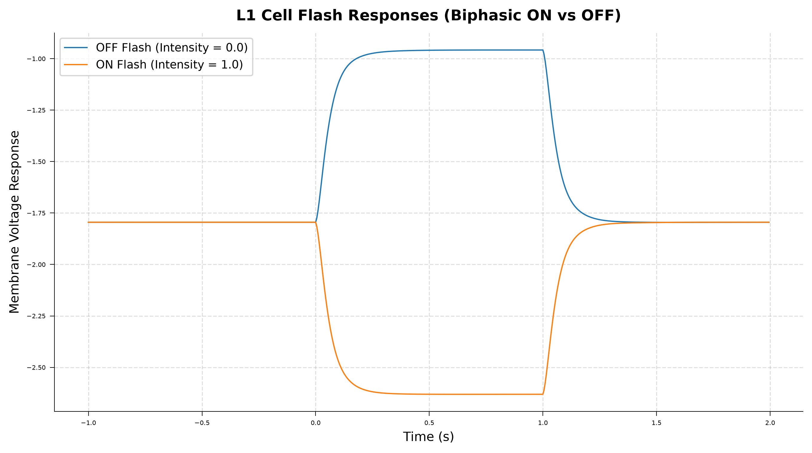
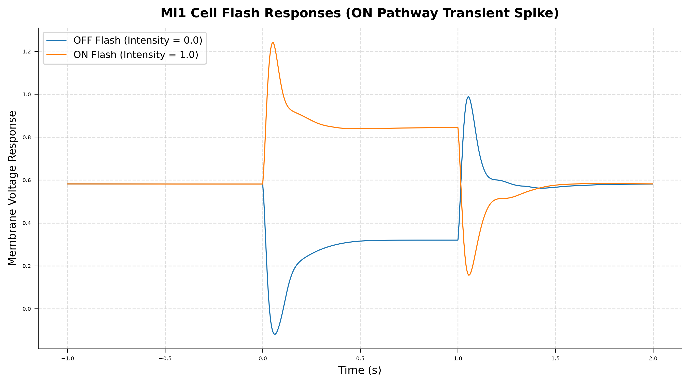
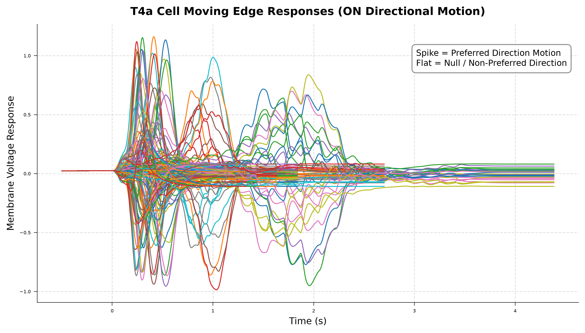
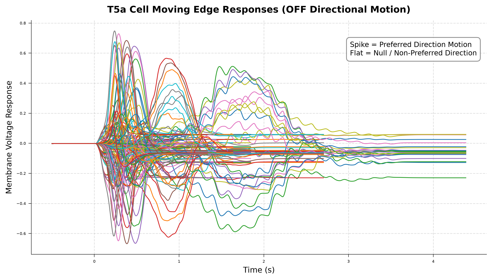

# Connectome-Constrained Neural Networks & Efficiency of Biological Priors

An exploration and benchmark of connectome-constrained deep mechanistic networks (DMNs) using the **`flyvis`** framework (*Nature 2024*, Lappalainen et al.).

This project reproduces published biological vision phenomena from the *Drosophila melanogaster* 64-cell-type optic lobe connectome and benchmarks the computational/data efficiency of biological connectivity priors against unconstrained neural network baselines.

---

## Project Highlights

- **Connectome Graph**: Modeled **45,669 neurons** and **1,513,231 synapses** across 64 cell types mapped to a 15-column hexagonal lattice.
- **Biologically Grounded**: Photoreceptors -> L1/L2 (Lamina contrast split) -> Mi1/Tm1 (Medulla temporal delay lines) -> T4/T5 (Lobula Plate direction-selective motion detectors).
- **GPU Accelerated**: Runs locally on PyTorch 2.5.1 + CUDA 12.1 (NVIDIA RTX 4050).

---

## Verified Reproductions (Nature 2024 Figures 1 and 2)

### 1. Flash Responses (Contrast Filtering in L1 and Mi1)
Simulated voltage responses across ON and OFF luminance flashes:
- **L1**: Demonstrates biphasic contrast filtering (hyperpolarizes to light increments, depolarizes to light decrements).
- **Mi1**: Demonstrates transient ON-pathway depolarization (providing temporal delay for downstream motion detectors).

| L1 Flash Response | Mi1 Flash Response |
|---|---|
|  |  |

---

### 2. Moving Edge Responses (Direction Selectivity in T4a and T5a)
Simulated 144 motion conditions across 24 cardinal angles:
- **T4a (ON Pathway)**: Selective for bright (ON) edges moving in preferred cardinal direction.
- **T5a (OFF Pathway)**: Selective for dark (OFF) edges moving in preferred cardinal direction.

| T4a ON Motion Detector | T5a OFF Motion Detector |
|---|---|
|  |  |

---

## Next Milestone: Constrained vs. Unconstrained Ablation

Benchmarking the **"Efficiency of Biological Priors"** thesis on the **Optic Flow Task**:
1. **Connectome-Constrained Network**: Fixed 64-cell-type biological graph (around 734 free parameters).
2. **Unconstrained Baseline**: Equal-size / equal-parameter randomly wired network.
3. **Metrics Evaluated**: Convergence speed, End-Point Error (EPE), and sample efficiency across dataset sub-fractions (10%, 25%, 50%, 100%).

---

## Repository Structure

```text
├── outputs/                         # Clean figure artifacts (PNG)
│   ├── l1_flash_responses.png
│   ├── mi1_flash_responses.png
│   ├── t4a_moving_edge_responses.png
│   └── t5a_moving_edge_responses.png
├── test_connectome.py              # Day 1: Connectome graph loader script
├── test_flash_responses.py         # Day 2: Flash stimulus response simulator
├── test_moving_edge_responses.py  # Day 3: Moving edge directional simulator
├── reproduction_report.md          # Comprehensive Days 1-3 report
├── .gitignore                      # Environment and data exclusion rules
└── README.md                       # Project documentation
```

---

## Quickstart

```bash
# 1. Clone repository
git clone <repo-url>
cd flyvis-connectome

# 2. Activate Python environment and run connectome verification
python test_connectome.py

# 3. Simulate flash and moving edge responses
python test_flash_responses.py
python test_moving_edge_responses.py
```

---

## References
- **Lappalainen et al. (2024)**. *Connectome-constrained deep learning models of the fruit fly visual system*. Nature.
- **TuragaLab/flyvis**: [GitHub Repository](https://github.com/TuragaLab/flyvis)
